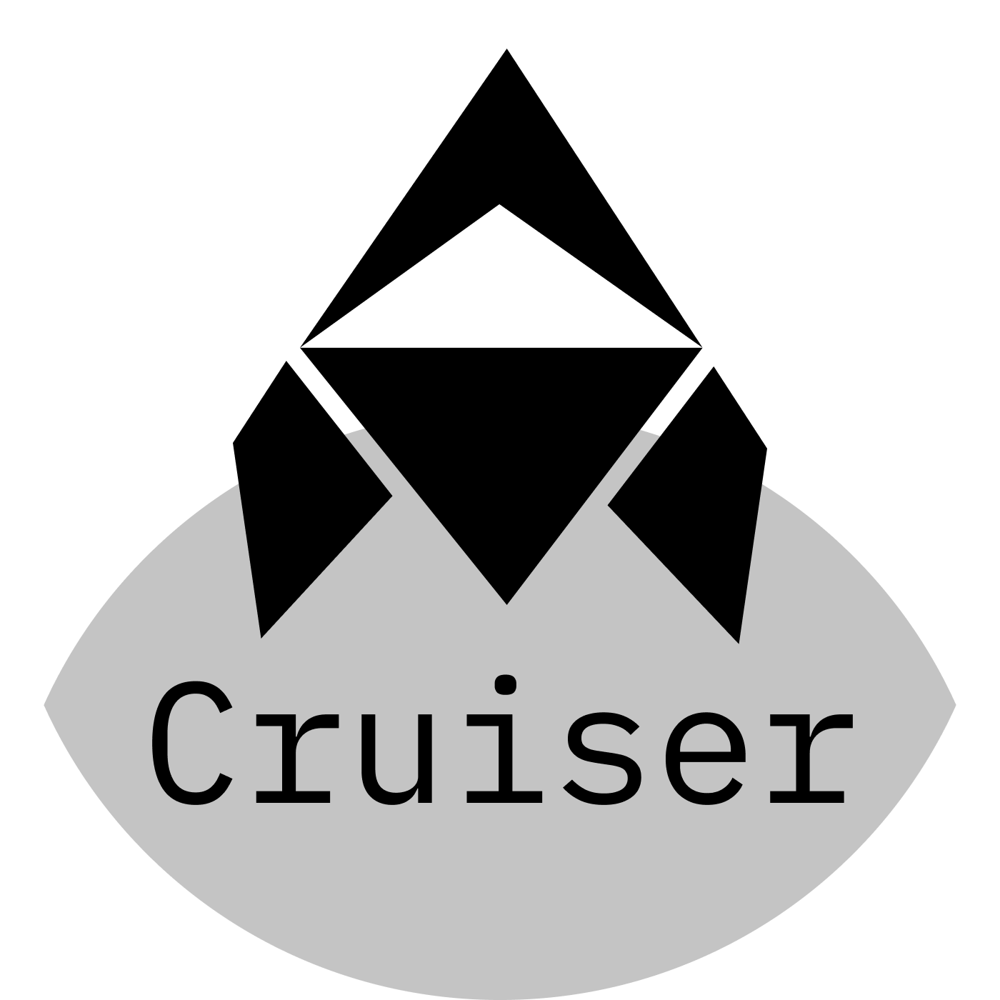

# Cruiser

Cruiser is a framework for helping build programs on Solana. The main focuses are extensibility and composability.
It is currently in an early alpha state with little documentation.

## Features
| Feature                       | Description                                                                                   | State                | Version |
|-------------------------------|-----------------------------------------------------------------------------------------------|----------------------|---------|
| Extensible Instruction System | Instruction data and accounts are built on a extensible tree system                           | Released             | `0.1.0` |
| Rust Code Generation          | Generates rust code for individual traits                                                     | Released             | `0.1.0` |
| All Code Generation Optional  | All the code generation is optional, if something doesn't do what you want you can replace it | Released             | `0.1.0` |
| Client Support                | Allows exporting your program as client code for others to call with                          | Released             | `0.2.0` |
| Auto Size implementation      | Automatically figures out the size of your accounts                                           | Partial Release      | `0.1.0` |
| IDL Generation                | Creates and IDL from rust code for client calling                                             | Not Started          | N/A     |
| Extensible IDL                | IDL can be extended to support any types                                                      | Not Started          | N/A     |
| Static Typescript From IDL    | Generates Static Typescript from an IDL Definition                                            | Not Started          | N/A     |
| In-Place Data Access          | Similar to Zero Copy, allows direct access to data rather than serde-ing it                   | Experimental         | N/A     |
| Anchor Support                | Hooks to allow some components in Cruiser to be used in anchor programs                       | Can be done manually | N/A     |
| Interface System              | Interface system allowing for generic interfaces across programs                              | Experimental         | N/A     |
| Full Testing Framework        | Testing framework in rust to allow for easy integration tests and fuzz testing                | Not Started          | N/A     |
